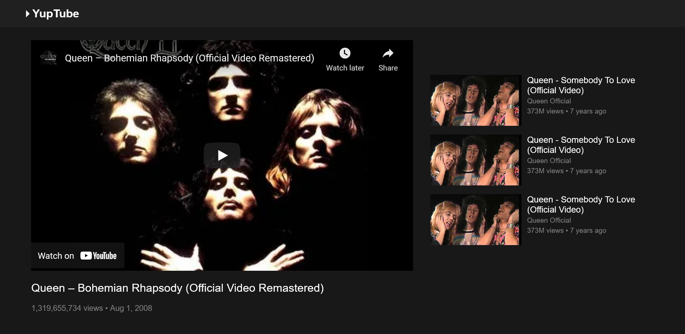
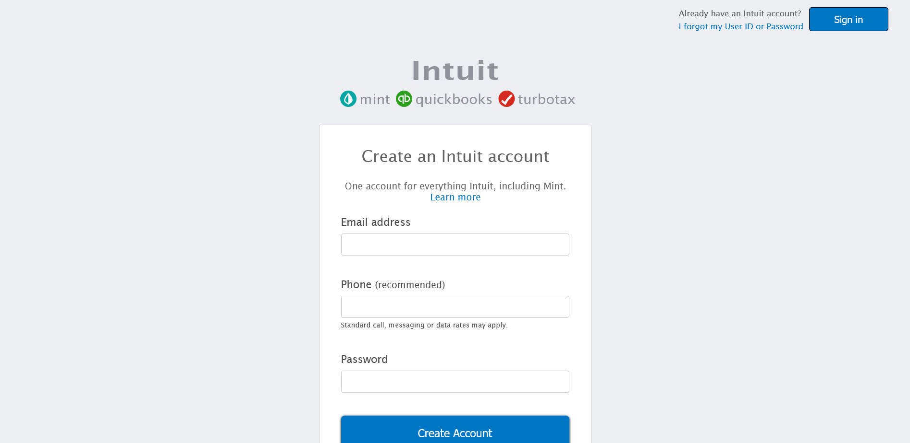
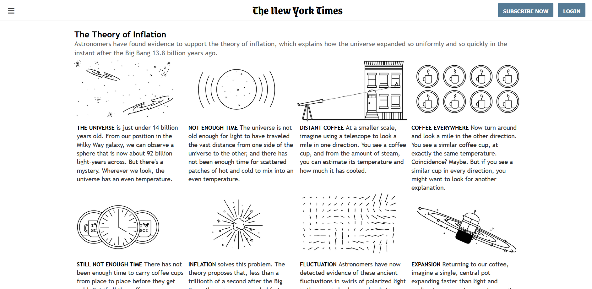
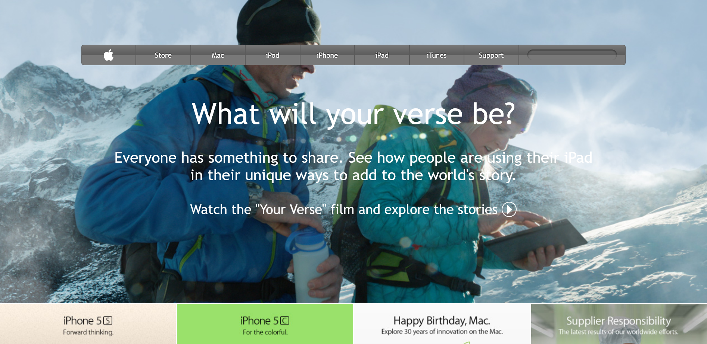
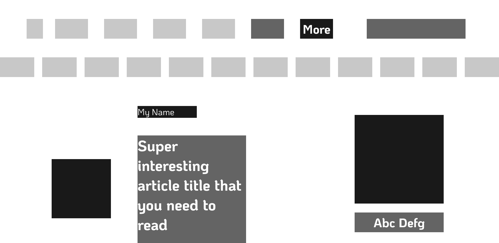
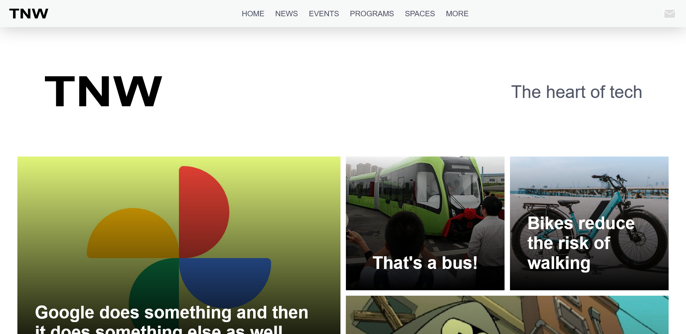

This is a collection of projects done as practice while following [TOP](https://theodinproject.com)'s HTML/CSS course in their Fullstack Javascript track.

[Live Preview](https://alessandrovinciabc.github.io/html-css-practice/index.html)

## Screenshot

Youtube Mock with embedded video

Clone of Intuit's signup form

New York Times cloned article

Apple 2014

Heatmap

TNW

